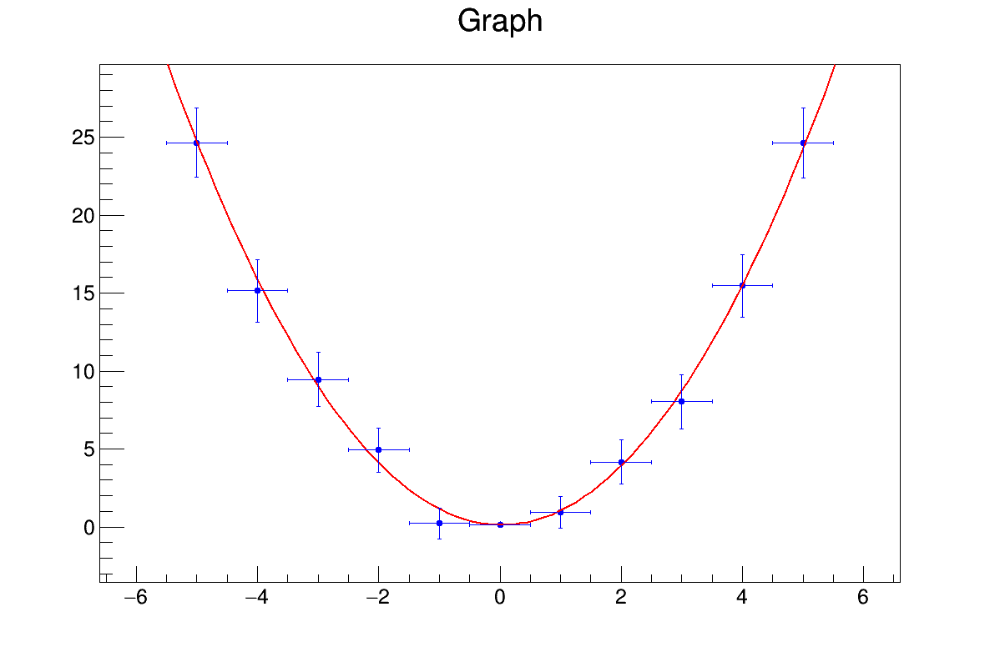

# ROOT CERN Tutorial

Examples for a first timer using ROOT, including histograms, stacks, graphs, multigraphs, 
functions, fitting and visual output 

Be sure to have ROOT installed: [ROOT](https://root.cern/install/)  

To use Makefile, go to initial folder.  
Let's say in folder main, we have a file called main.cpp with our _int main()_ function.  
$make bin/main.exe  
$./bin/main.exe  
This compiles and runs main.exe  

To delete everything in bin/ use  
$make clean  

To print your project files in the terminal use  
$make dump  

